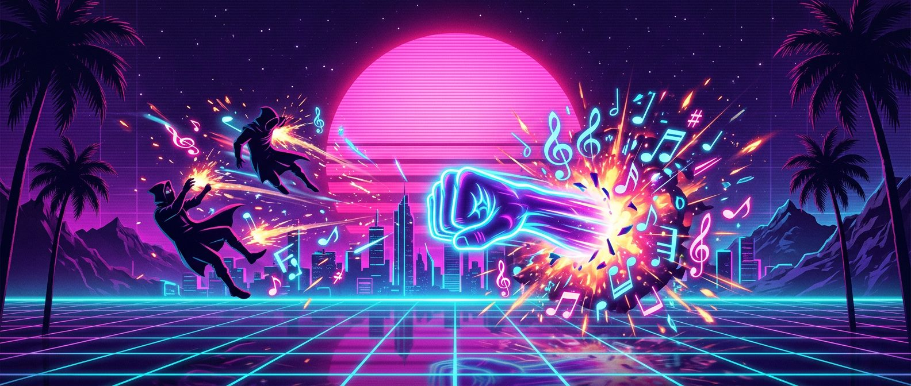
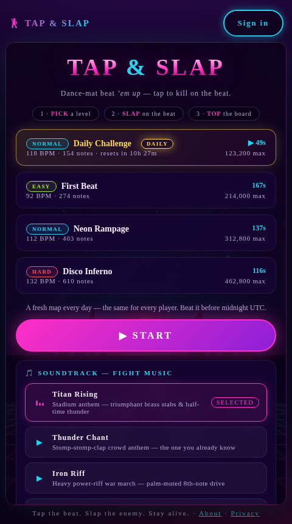
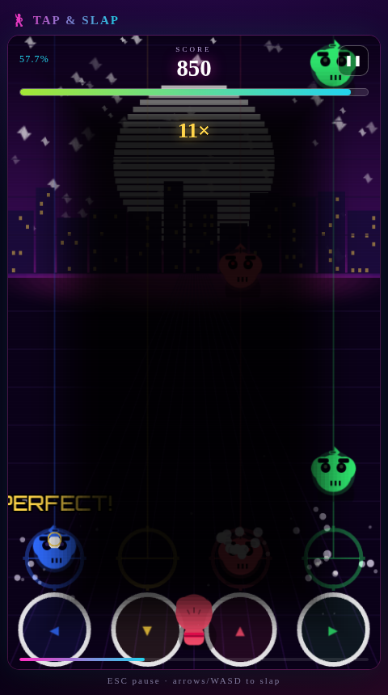
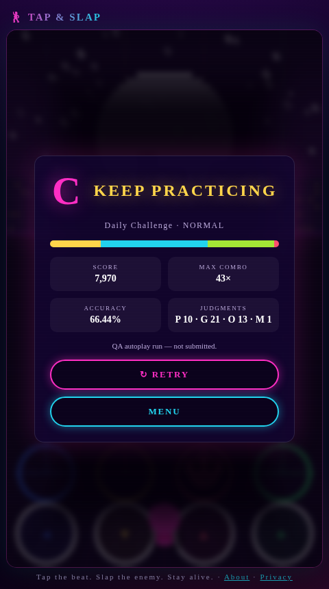

<p align="center">
  
</p>

<h1 align="center">🕺 TAP &amp; SLAP</h1>

<p align="center">
  <b>A dance-mat beat 'em up.</b> Enemies march down four neon lanes <i>on the beat</i> —<br/>
  slap them dead by tapping the right lane at the exact musical moment.
</p>

<p align="center">
  <a href="https://tap-and-slap.vercel.app"><b>▶ PLAY NOW</b></a>
  &nbsp;·&nbsp; free, no sign-up · <a href="https://tap-and-slap.vercel.app">tap-and-slap.vercel.app</a>
</p>

<p align="center">
  
</p>

<p align="center">
  <a href="https://github.com/DLinacre/tap-and-slap/blob/main/LICENSE"></a>
  <a href="https://nextjs.org"></a>
  <a href="https://phaser.io"></a>
  <a href="https://www.typescriptlang.org"></a>
  <a href="https://www.prisma.io"></a>
  <a href="https://vitest.dev"></a>
  <a href="https://www.playwright.dev"></a>
  <a href="https://github.com/DLinacre/tap-and-slap/actions"></a>
  <a href="https://tap-and-slap.vercel.app"></a>
  <a href="https://github.com/DLinacre/tap-and-slap"></a>
  <a href="https://github.com/DLinacre/tap-and-slap/issues"></a>
  
</p>

---

## 🎯 What is it?

**Tap & Slap** fuses the dance-mat lane gameplay of *DDR/StepMania* with the
punch-kick-on-the-beat fantasy of *Dead as Disco*: enemies descend four neon
lanes to the beat, and you kill them by hitting the **right lane at the right
musical moment**. Perfect hits (≤ 45 ms from the beat) build combo multipliers
up to ×8; misses cost health. One screen, one mechanic, endless mastery.

Built as a **production-grade monolith** — Next.js 15 + Phaser 3 + TypeScript —
with zero licensed assets: the artwork is procedural and the entire soundtrack
is synthesized live in the browser.

## 🎵 Fight soundtrack

Every track is an **original procedural composition** that leans on grooves
everyone already feels — no licensed audio needed. Pick one per level (tap to
preview in-game):

| Track | Vibe | Signature |
|---|---|---|
| 🥁 **Titan Rising** | Stadium anthem | Half-time thunder, triumphant brass stabs |
| 👏 **Thunder Chant** | Crowd anthem | The stomp-stomp-clap groove you already know |
| 🎸 **Iron Riff** | Heavy war march | Palm-muted power riff, four-on-the-floor |
| 💃 **Neon Inferno** | Disco war | Four-on-floor, offbeat hats, funky 16ths |
| 🎻 **Ode to Joy** | Classical remix | Beethoven's public-domain anthem, modernized |

A master chain (gain → compressor → limiter) with a kick sidechain pump keeps
the mix loud, punchy and club-ready; every kick ducks the music bus for that
satisfying "pump" feel.

## ✨ Features

- **4-lane dance-mat gameplay** — arrows, WASD, touch pads, or tap enemies directly
- **Precision rhythm math** — PERFECT ≤ 45 ms · GREAT ≤ 90 ms · GOOD ≤ 135 ms
- **Combo depth** — ×8 multiplier ladder, health economy, heavy enemies (×1.5 pts), minis (×0.5)
- **Perfect-hit juice** — sparkle chimes, expanding shockwaves, "ON FIRE!" streak calls, ascending combo-milestone arpeggios
- **Grades** — SSS → D on every run, FLAWLESS for zero misses
- **3 shipped levels + a Daily Challenge** — *First Beat* (EASY) · *Neon Rampage* (NORMAL) · *Disco Inferno* (HARD), plus a fresh deterministic map every day with its own leaderboard
- **Synthwave visuals** — sliced sun, twinkling stars, scrolling grid, CRT scanlines, vignette, AI-generated menu art
- **Leaderboards** — guest play with zero sign-up, optional accounts (bcrypt + JWT), server-side anti-cheat integrity checks, offline score queue
- **Accessibility** — keyboard-only playable, timing calibration, per-channel volume (Master / Music / SFX)

## 📸 Screenshots

<p align="center">
  
  
  
</p>

## 🖼️ Repository polish

- **Social preview** (the image shown when the repo is shared on X/Twitter, Slack, etc.): upload [`social-preview.jpg`](./social-preview.jpg) (1280×640) at **Settings → Social preview** — this is a one-minute manual step that makes every link share beautifully.
- **Live demo:** add a `homepage` URL in repo settings once the app is deployed (e.g. a Vercel/Netlify URL) so the repo header links straight to the playable game.

## 🚀 Quick start

```bash
git clone https://github.com/DLinacre/tap-and-slap.git
cd tap-and-slap
npm install
cp .env.example .env          # set AUTH_SECRET (dev fallback exists)
npm run db:setup              # migrate + seed (levels, demo user, sample runs)
npm run dev                   # → http://localhost:3000
```

Demo account (seeded): `demo@tapslap.dev` / `tap-slap-demo`

## 🎮 Controls

| Input | Action |
|---|---|
| `◀ ▼ ▲ ▶` (arrows) or `W A S D` | Slap a lane |
| Tap pads / tap enemies | Same, on touch |
| `ESC` / `P` | Pause / resume |
| Settings → Offset | Timing calibration (±100 ms) |

## 🧪 Quality gates

```bash
npm run lint                  # ESLint (flat config, zero warnings)
npm run typecheck             # tsc --noEmit (strict + noUncheckedIndexedAccess)
npm test                      # 81 unit/component tests (Vitest)
npm run build && npm run test:e2e   # 4 Playwright smoke tests vs production build
```

CI (`.github/workflows/ci.yml`) runs every gate on push/PR:
**lint → typecheck → unit → production build → seed → E2E**.

## 📁 Project map

```
docs/               PRD, architecture, DB schema, API spec, security, execution plan
src/app/            Next.js App Router + /api routes
src/game/           Phaser engine (levels/ + audio/ are pure TS, shared with the server)
src/components/     React shell: menus, HUD, overlays
src/lib/            db, auth, validation, services, rate limits, client API
src/store/          Zustand: game state + persisted settings
prisma/             schema, migration, seed
tests/              unit, component, e2e (+ mocks)
screenshots/        in-game captures
```

## 📚 Documentation

| Doc | Contents |
|---|---|
| [docs/01-PRD.md](docs/01-PRD.md) | Vision, personas, journeys, functional & non-functional specs |
| [docs/02-architecture.md](docs/02-architecture.md) | System design, folder tree, module boundaries, data flow |
| [docs/03-database.md](docs/03-database.md) | ERD, SQL DDL, indexing, lifecycle |
| [docs/04-api.md](docs/04-api.md) | Endpoints, DTOs, state management, component hierarchy |
| [docs/05-security-quality.md](docs/05-security-quality.md) | Threat model, validation, auth, secrets, testing strategy |
| [docs/06-execution-plan.md](docs/06-execution-plan.md) | Phases, deployment runbook, risks |


## ❓ FAQ

**How does scoring work?**
Every enemy is worth base points (100 normal · 150 heavy · 50 mini) multiplied
by your combo multiplier (up to ×8) and a timing weight — PERFECT ×1.0,
GREAT ×0.7, GOOD ×0.4. Misses reset your combo and cost health.

**Is the music licensed?**
No. Every track is an original composition generated in your browser from the
level's beat map — including the stomp-stomp-clap crowd anthem and the
heavy-riff war march. The one exception is *Ode to Joy* (Beethoven, 1824),
which is in the public domain. Everything is safe to use commercially.

**What is the Daily Challenge?**
A fresh map every day (resets at midnight UTC) that is identical for every
player, with its own leaderboard. The map is derived deterministically from
the date — no server job needed.

**Why does timing feel off?**
Open Settings → Offset and adjust calibration by ±100 ms to match your
display's latency.

**Do I need an account?**
No — you can play and post scores as a guest. Accounts (optional) just put
your name on the leaderboard.

**Where do I report a bug or a security issue?**
Bugs → issues (use the bug template). Security → [SECURITY.md](./SECURITY.md)
(private report only).

## ♿ Accessibility

- Keyboard-only playable (arrows/WASD, `ESC`/`P` to pause); visible focus rings
- `prefers-reduced-motion` support; pinch-zoom enabled (WCAG 2.2)
- Judgment feedback is colour + text (never colour-only); alt text on all media
- axe-core scan: 0 violations; [accessibility notes](https://github.com/DLinacre/tap-and-slap/blob/main/src/app/globals.css)
- Privacy: see [Privacy page](https://tap-and-slap.vercel.app/privacy) — no
  trackers, no analytics by default
## 🛣️ Roadmap

Insane difficulty + daily seeded challenge → level editor → replay-based
anti-cheat → PWA + haptics → social leaderboards → licensed OST pipeline.

## ⚖️ License

[MIT](./LICENSE) © 2026 Tap & Slap contributors.
All music is original procedural composition (one exception: *Ode to Joy*,
public domain) — no copyrighted material is sampled or reproduced.
